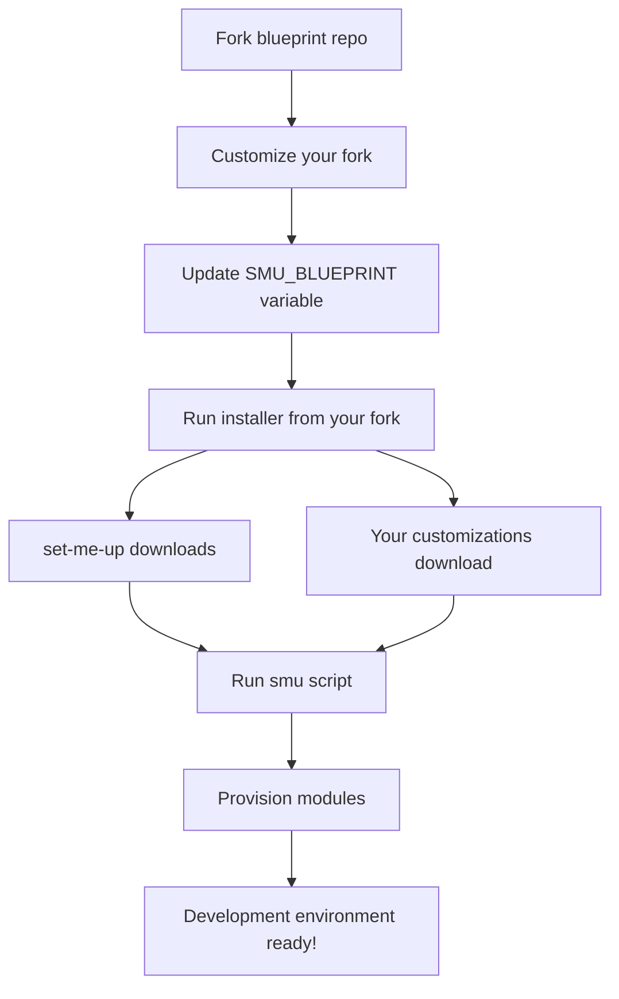
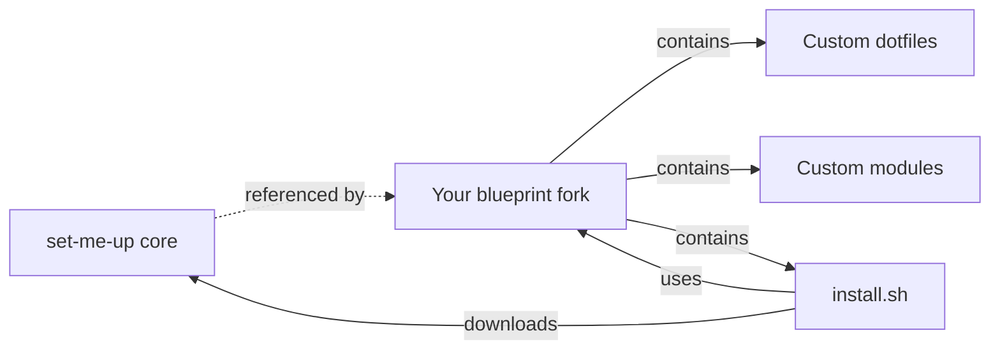
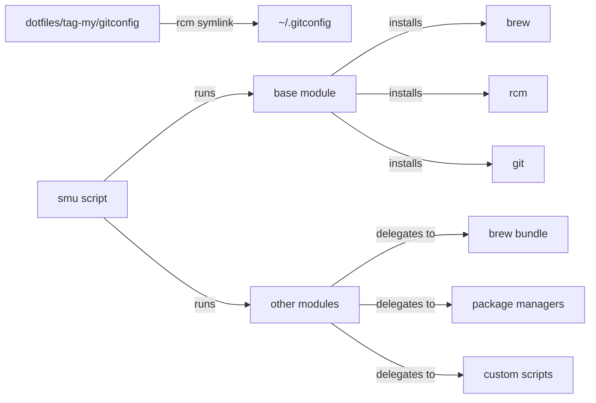

# set-me-up 👷🏼

> Simplify the setup and maintenance of macOS development environments through automated dotfiles and modular shell scripts.


## Overview

`set-me-up` automates the tedious process of configuring development environments by providing:

- 🔧 **Modular architecture** - Pick only the modules you need
- 📦 **Package management** - Automated installation via Homebrew and other package managers
- 🔗 **Dotfile management** - Intelligent symlinking powered by `rcm`
- 🎨 **Highly customizable** - Fork the blueprint and make it your own
- 🔄 **Version control friendly** - Keep your customizations separate from the core tool

## Table of Contents

- [Overview](#overview)
- [Quick Start](#quick-start)
- [Getting Started](#getting-started)
  - [1. Fork the Blueprint](#1-fork-the-blueprint)
  - [2. Install set-me-up](#2-install-set-me-up)
  - [3. Run the Setup](#3-run-the-setup)
- [Customization](#customization)
  - [Using Hooks](#using-hooks)
  - [Using RCM Tags](#using-rcm-tags)
  - [Creating a Custom Tag](#creating-a-custom-tag)
- [How It Works](#how-it-works)
  - [The Architecture](#the-architecture)
  - [The smu Script](#the-smu-script)
  - [Under the Hood](#under-the-hood)
- [Credits](#credits)
- [License](#license)

## Quick Start

> ⚠️ **Important**: Always review the modules and dotfiles before running any installation commands. Your system, your responsibility!

```bash
# 1. Fork https://github.com/dotbrains/set-me-up-blueprint
# 2. Customize your fork
# 3. Run the installer from YOUR fork
bash <(curl -s -L https://raw.githubusercontent.com/YOUR-USERNAME/YOUR-REPO/BRANCH/dotfiles/modules/install.sh)

# 4. Provision your system
smu --provision --module base
smu --provision --module casks --module php --no-base
```

## Getting Started



### 1. Fork the Blueprint

The recommended approach is to fork the [blueprint repository](https://github.com/dotbrains/set-me-up-blueprint) and customize it to your needs. The blueprint is a lean template with an example [tag](#using-rcm-tags) and module structure.

**Steps:**

1. **Fork** the [blueprint repository](https://github.com/dotbrains/set-me-up-blueprint)
2. **Customize** by adding dotfiles, modules, and configurations in `tag-example` (or create your own tag)
3. **Update** the `SMU_BLUEPRINT` variable in `dotfiles/modules/install.sh` to point to your fork (e.g., `yourname/dotfiles`)
4. **Use** the installer from your fork to download `set-me-up` and your customizations

**Real-world example:** [nicholasadamou/dotfiles](https://github.com/nicholasadamou/dotfiles)

**Why fork instead of using the main repo directly?**



- **Loose coupling** - Your repo connects to `set-me-up` only through the installer
- **Portable dotfiles** - Keep your configurations even if you stop using `set-me-up`
- **Privacy friendly** - Easy to make your setup private with no direct ties to the main repo
- **Clean history** - Your commit history stays focused on your customizations
- **Version pinning** - The installer locks to a specific `set-me-up` version; upgrade by bumping the version

### 2. Install set-me-up

Once you've forked and customized the blueprint, run the installer from your fork.

> ⚠️ **Warning**: Do NOT run this if you don't understand what it does. Review the installer script first!

Replace:
- `YOUR-USERNAME` with your GitHub username
- `BRANCH-NAME-HERE` with your branch (typically `main` or `master`)

**For bash/zsh:**

```bash
bash <(curl -s -L https://raw.githubusercontent.com/YOUR-USERNAME/set-me-up-blueprint/BRANCH-NAME-HERE/dotfiles/modules/install.sh)
```

**For fish shell:**

```bash
curl -s -L https://raw.githubusercontent.com/YOUR-USERNAME/set-me-up-blueprint/BRANCH-NAME-HERE/dotfiles/modules/install.sh | bash
```

**Custom installation directory:**

```bash
export SMU_HOME_DIR="/path/to/directory"
bash <(curl -s -L https://raw.githubusercontent.com/YOUR-USERNAME/set-me-up-blueprint/BRANCH-NAME-HERE/dotfiles/modules/install.sh)
```

> 💡 **Tip**: Keep `SMU_HOME_DIR` in your shell profile so the `smu` scripts can find the sources.

### 3. Run the Setup

[](http://xkcd.com/1319/)

**Step 1: Run the base module**

The base module sets up essential tools (Homebrew, Git, RCM) and symlinks your dotfiles.

```bash
smu --provision --module base
```

> ⚠️ **Important**: Don't move the source folder after running the base module (symlinks will break).

**Step 2: Provision additional modules**

Install only what you need. View [available modules](https://github.com/dotbrains/set-me-up-blueprint/tree/master/dotfiles/modules).

```bash
smu --provision \
    --module app_store \
    --module casks \
    --module php \
    --no-base
```

**Useful commands:**

```bash
smu --help              # Show all available options
smu --lsrc              # Preview how rcm will manage your dotfiles
smu --rcup              # Manually re-run dotfile symlinking
smu --rcdn              # Remove symlinked dotfiles
```

## Customization

### Using Hooks

To customize the setup to your needs `set-me-up` provides two hook points: Before and after sourcing the module script.

Before hooks enable you to perform special preparations or apply definitions that can influence the module. All `smu` base variables are defined to check if an existing declaration already exists, giving you the possibility to come up with your own values.

Polishing module setups or using module functionality can be done with after hooks. A bit of inspiration: By calling git commands in an after hook file you could replace the git username and email placeholders or install further extensions.

To use hooks provide a `before.sh` or `after.sh` inside the module directory. Use `rcm` tags to provide the hook files.

### Using RCM Tags

[RCM tags](http://thoughtbot.github.io/rcm/rcup.1.html) allow you to override default files without modifying `set-me-up` source files.

**How it works:**

1. [Create your own tag](#creating-a-custom-tag)
2. Duplicate the directory structure and files you want to modify
3. Your files take precedence over the defaults

**Example:** To override the `brewfile` for the `app_store` module:

```
dotfiles/tag-my/modules/app_store/brewfile
```

**Key points:**

- `rcm` symlinks all files it finds in your tags
- Files aren't merged—your version completely replaces the default
- You can add entirely new dotfiles and modules

**Useful commands:**

```bash
smu --lsrc    # Preview how rcm manages your dotfiles
smu --rcup    # Symlink dotfiles using rcup
smu --rcdn    # Remove symlinked dotfiles
```

### Creating a Custom Tag

**Steps:**

1. Create a folder with the `tag-` prefix in the `dotfiles` directory:
   ```bash
   mkdir dotfiles/tag-my
   ```

2. Add your tag to `.rcrc` (place it before existing tags for higher precedence):
   ```bash
   TAGS="my example"
   ```

3. Add your custom files following the same structure as the main dotfiles directory

## How It Works

### The Architecture

The blueprint and core are loosely coupled through the installer, giving you complete control over your dotfiles while benefiting from `set-me-up`'s automation.

### [The smu Script](https://github.com/dotbrains/set-me-up-installer/blob/main/smu)

The `smu` script is part of the `set-me-up` toolkit, designed to automate the setup of a development environment on macOS or Debian-based Linux systems. It begins by sourcing utility functions and defining key paths for the installation process. The script detects the operating system and creates necessary configuration files if they do not already exist. It then checks for the presence of essential tools like Homebrew, Python 3, RCM, and Git, installing them if necessary. The script also ensures that Homebrew is properly initialized and its paths are correctly set. Finally, it pulls the latest updates from the `set-me-up-installer` repository and runs the [`smu.py`](https://github.com/dotbrains/set-me-up-installer/blob/main/smu.py) script to complete the setup process. The `smu` script streamlines the configuration of a consistent development environment, saving time and reducing the potential for errors.

### Under the Hood

> Hamid: What's that?

> Rambo: It's blue light.

> Hamid: What does it do?

> Rambo: It turns blue.

**TL;DR;** It symlinks all dotfiles and stupidly runs shell scripts.



**What `smu` does:**

1. **Symlinks dotfiles** - Uses [rcm](https://github.com/thoughtbot/rcm) to symlink files from `dotfiles/` to your home directory
   - Example: `dotfiles/tag-my/gitconfig` → `~/.gitconfig`

2. **Installs base tools** - The base module ensures Homebrew, Git, and RCM are installed

3. **Runs modules** - Each module automates installation of specific tools:
   - Delegates to appropriate package managers (Homebrew, npm, pip, etc.)
   - Runs custom scripts for specialized setup
   - Respects hooks for pre/post-installation customization

**Want to know more?**

The best documentation is the code itself. Check out the [module scripts](https://github.com/dotbrains/set-me-up-blueprint/tree/master/dotfiles/modules) to see exactly what they do.

`set-me-up` is just bash scripts and familiar tools—nothing magical, just automation done right! 😄

## Credits

- [omares/set-me-up](https://github.com/omares/set-me-up) for the initial platform that [dotbrains/set-me-up](https://github.com/dotbrains/set-me-up) was built on.
- [donnemartin/dev-setup](https://github.com/donnemartin/dev-setup)
- [mathiasbynens](https://github.com/mathiasbynens/dotfiles) for his popular [macOS script](https://github.com/mathiasbynens/dotfiles/blob/master/.macos).
- [brew](https://brew.sh/) and [brew bundle](https://github.com/Homebrew/homebrew-bundle) for the awesome package management.
- [thoughtbot rcm](https://github.com/thoughtbot/rcm) for easy dotfile management.
- All of the authors of the installed applications via `set-me-up` , I am in no way connected to any of them.

Should I miss your name on the credits list, please let me know! ❤️

## License

The code is available under the [MIT license](LICENSE).
